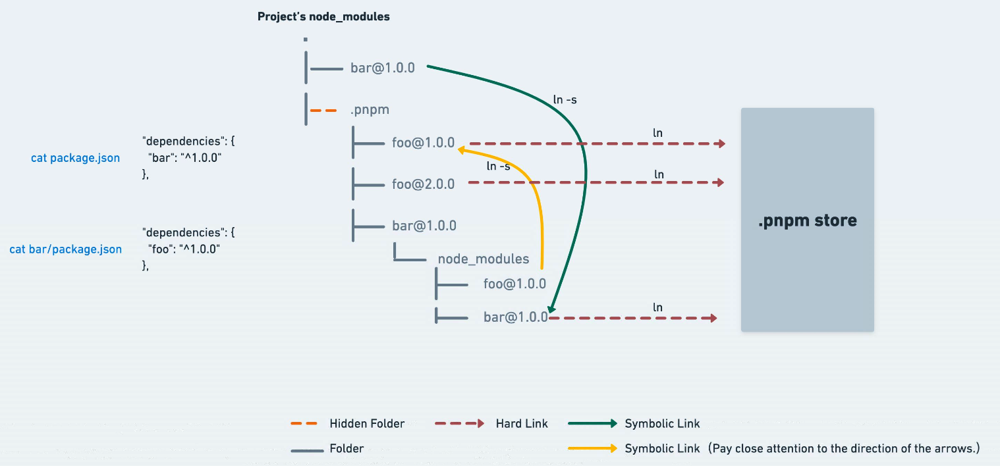

패키지 매니저 => 프로젝트가 의존하고 있는 패키지 관리(설치, 갱신, 삭제)

대부분 js 패키지 매니저는

- nodejs 런타임에서 동작
- package.json에 의존 패키지 목록 명시
- 패키지는 node_modules 디렉토리에 저장

## npm (node package manager)

nodejs의 표준 패키지 매니저

### npx (node package runner)

npm에서 제공해주는 도구.

- 패키지 최신버전 파일 가져와서 설치/실행, 이후 패키지 제거
- create-react-app 같이 모듈이 많고 업데이트가 잦을때 npx 사용해 설치함

## yarn (yet another resource negotiator)

facebook에서 npm 단점 보완

- 성능/설치속도 : yarn은 다운받은 패키지 데이터를 캐시에 저장. 중복된 데이터는 다운로드x. + 병렬적으로 설치함.
- 보안 : yarn-lock으로 모든 디바이스에 같은 패키지 설치 보장. (npm도 package.json 잠금 파일 제공하므로 비슷함)

=> 현재는 npm도 꽤 발전해 yarn과 속도 차이 비슷.

```bash
yarn add 주소 : 특정 저장소 내 패키지 설치. 주로 github을 이와 같이 설치
yarn global add package_name : 글로벌 설치. 로컬의 다른 프로젝트도 이 패키지 사용 가능
yarn upgrade : 설치한 패키지들 업데이트
yarn dedupe : 중복 설치된 패키지들 정리해주는 명령어
```

## npm, yarn

npm v2까지는 같은 모듈 의존시 전부 폴더 구조 만들어서 사용 => 중복 많아짐

npm v3~, yarn은 호이스팅 기법 사용. => 중복되는 걸 호이스팅해서 flat하게 사용.

- 유령 의존성 문제 : 의존하고 있지 않은 라이브러리를 require 하는 현상
  - 분명 설치를 하지 않아서 오류가 나야 하지만, package.json에 명시되어 있지 않아도 다른 라이브러리의 하위 의존성을 기준으로 있다고 판단하고 의존하는 문제 => 버전이 명확하지 않아 문제 발생할 수 있음.
- 중복 의존성 문제 : 용량 문제. 게다가 서로 다른 버전으로 중복 의존하면 의존성이 꼬이는 문제도 발생.

## yarn berry

facebook에서 발표한 yarn의 2번째 버전 (2020)

=> PnP(Plug'n Play)이라는 새로운 패키지 관리 방식을 통해 유령 의존성 문제 해결

PnP가 뭐냐면,

- 패키지를 프로젝트의 node_modules 디렉토리에 저장x

패키지 의존성 정보는 `.zip` 파일로 압축해 `.yarn/cache` 폴더에 저장. 이를 찾기 위한 정보를 `.pnp.cjs` 파일에 기록함

.pnp.cjs 파일을 이용해서 별도의 디스크 I/O 작업 없이도 패키지 위치 정확히 파악 가능. => 시간 단축, 중복 설치 방지.

- node_modules를 만들고 패키지들을 호이스팅할 필요 없음.

```bash
/* react 패키지 중에서 */
["react", [
  /* npm:17.0.1 버전은 */
  ["npm:17.0.1", {
    /* 이 위치에 있고 */
    "packageLocation": "./.yarn/cache/react-npm-17.0.1-98658812fc-a76d86ec97.zip/node_modules/react/",
    /* 이 의존성들을 참조한다. */
    "packageDependencies": [
      ["loose-envify", "npm:1.4.0"],
      ["object-assign", "npm:4.1.1"]
    ],
  }]
]],
```

현재 npm, pnpm에서도 이 방식 제공.

### 장점

1. 무거웠던 node_modules 제거했기에, 의존성까지도 github에 게시 가능.
   - `zero-install` : yarn install 같은 거 할 필요 없으므로 ci에서 의존성 설치 시간 절약 가능.
2. 각 패키지가 zip 아카이브로 압축되어 있어 스토리지 용량 절약 (npm node_modules는 400MB, yarn pnp 사용시 120MB에 불과)
3. 의존성 구성 파일 수 적으므로, 변경사항 감지 및 의존성 관리 작업 속도 빨라짐.

## pnpm (performant npm)

2017에 나온, npm, yarn 비효율 개선한 노드 패키지 매니저

어떤 비효율 => 여러 프로젝트가 같은 의존성하면 100개 프로젝트의 node_modules에 100개의 똑같은 리액트 라이브러리 설치한다든지

- 로컬 하드 디스크 무리

pnp(Plug'n Play) 지원

pnpm은 홈디렉토리의 글로벌 저장소인 `~/.pnpm-store`에 모든 패키지 저장. 중첩된 패키지는 1번만 설치.

content addressable file store 방식.

- content-addressable memory(CAM, 연관메모리 또는 연관기억장치라고도 함)를 사용함.

  - 빠르게 탐색할 때 사용하는 특수 메모리.
  - 주소로 접근하지 않고, 기억된 내용 일부로 접근

- 단순히 파일 이름으로만 접근x, 각각의 의존성 파일에 hash id를 부여하고 관리.
- 이 과정에서 중복되는 패키지는 동일한 hash id를 얻게 됨.

필요한 프로젝트마다 node_modules 폴더에 symbolick(sym) link를 만들어 연결.



- 호이스팅을 사용해 flat하게 만들지 않고(npm, yarn은 플랫하게 저장) npm v2처럼 nested하게 저장하는 구조.
- 예를 들어, 100개 프로젝트에서 lodash 모두 쓴다면
  - npm이나 yarn은 loadash를 100개 복사하지만
  - pnpm은 lodash를 1번만 설치하고, 다른 99개 프로젝트에서는 심링크로 연결해 용량 절약

버전만 다른 라이브러리 사용시?

- 글로벌 저장소에 있는 라이브러리 update하지 않고, 다른 버전 라이브러리만 새로 추가해 버전 호환 문제 생기지 않도록 함.

특히 pnpm은 모노레포에서 좋음.

- 쉬운 코드 재사용, 간단한 의존성 관리, 원자적 커밋(커밋할 때마다 모든 것이 함께 작동동, 변경 사항의 영향을 받는 곳에서 쉽게 변화를 탐지), 큰 스케일의 코드 리팩토링, 팀 간의 협업, 테스트 빌드 범위 최소화
- 모노레포만을 위한 명령어도 존재함.

## References

[[패키지 매니저] npm, yarn, pnpm, yarn-berry](https://velog.io/@seobbang/%ED%8C%A8%ED%82%A4%EC%A7%80-%EB%A7%A4%EB%8B%88%EC%A0%80-npm-yarn-pnpm-yarn-berry)<br>
[node_modules로부터 우리를 구원해 줄 Yarn Berry](https://toss.tech/article/node-modules-and-yarn-berry)<br>
[JavaScript Package Managers - npm, yarn, pnpm에 대해](https://velog.io/@ckstn0777/JavaScript-Package-Managers-npm-yarn-pnpm-%EC%97%90-%EB%8C%80%ED%95%B4#npm2-%EC%9D%BC-%EB%95%8C%EC%9D%98-%EC%9D%98%EC%A1%B4%EC%84%B1-%EA%B4%80%EB%A6%AC)<br>
[패키지 매니저, 그것이 궁금하다](https://medium.com/zigbang/%ED%8C%A8%ED%82%A4%EC%A7%80-%EB%A7%A4%EB%8B%88%EC%A0%80-%EA%B7%B8%EA%B2%83%EC%9D%B4-%EA%B6%81%EA%B8%88%ED%95%98%EB%8B%A4-5bacc65fb05d)<br>
[기능 비교 | pnpm](https://pnpm.io/ko/next/feature-comparison)<br>
[Yarn berry workspace를 활용한 프론트엔드 모노레포 구축기](https://techblog.woowahan.com/7976/)<br>
[Yarn Berry, 굳이 도입해야 할가?](https://medium.com/teamo2/yarn-berry-%EA%B5%B3%EC%9D%B4-%EB%8F%84%EC%9E%85%ED%95%B4%EC%95%BC-%ED%95%A0%EA%B9%8C-d6221b9beca6)<br>
[PNPM - renew](https://velog.io/@kbm940526/PNPM-renew)<br>
