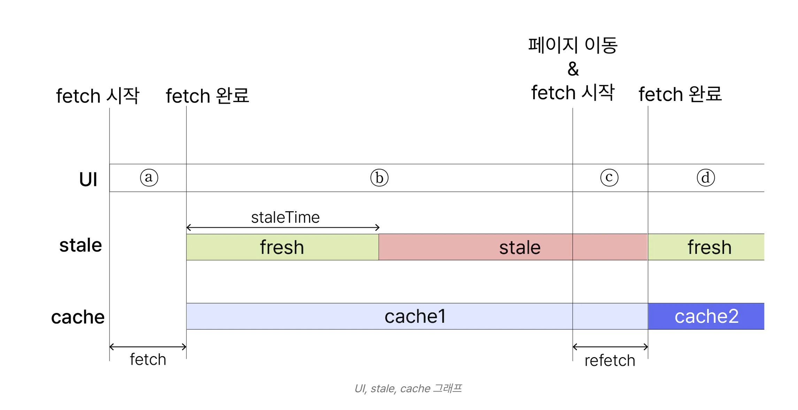
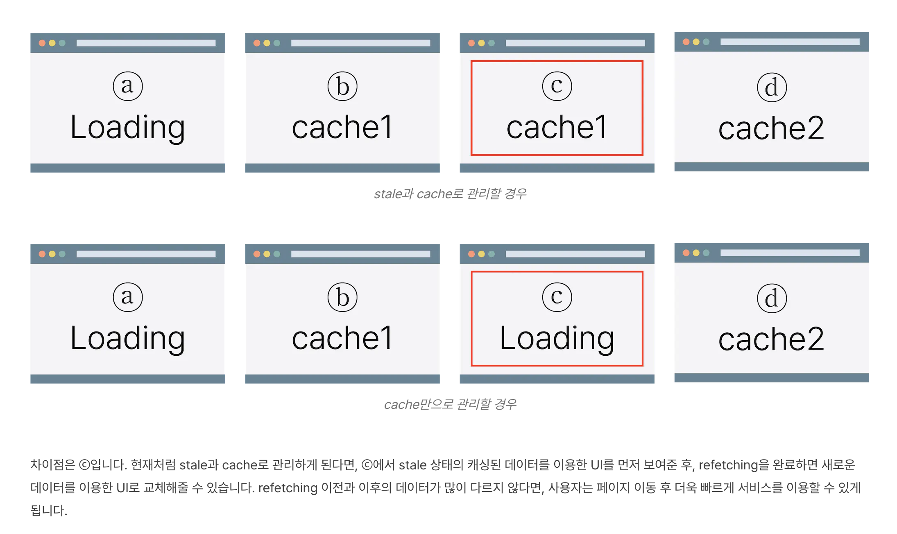

### stale, cache

staleTime => 가져온 서버 데이터가 얼마나 오래되었는지(stale).

- 기본값 0이면 즉시 fresh에서 stale로 변경됨.
- fresh는 신선한 데이터, stale은 새로 fetch해와야 하는 신선하지 못한 데이터로 간주.

cacheTime

- 기본값 5분. 5분간 데이터를 메모리에 저장.
- cache에 존재하더라도, 데이터가 stale 상태면 refetch

즉, cache가 존재하지 않으면 새로운 데이터를 가져올 때, loading을 보여줘야 함.

- 반면 cache가 존재하면, 새로운 데이터를 가져올 때 cache 데이터를 보여줌.
- 데이터 형태가 다이나믹하게 다른 게 아니라면 비슷한 ui로 계속해서 신선한 데이터를 보여줄 수 있음.

### refetch

수동

- refetchOnMount => 컴포넌트 마운트 시 refetch 조건 
- refetchOnWindowFoucs => 윈도우 포커스 시 refetch 조건
- refetch 훅

자동

- refetchInterval => 브라우저 포커스되어야 일정시간 자동으로 refetch
- refetchIntervalInBackground => 브라우저 포커스 아니어도 refetch

### query, mutation

get => useQuery, 
post,put,patch,delete => useMutation

### retry

요청 실패 시 retry

### queryKey

querykey를 기반으로 쿼리 캐싱 관리. 배열 형태.

### QueryFunctionContext

쿼리함수(queryFn, mutationFn)의 파라미터를 지칭.

- queryKey: 쿼리키
- pageParam: 현재 페이지 파라미터 정보(infinity query에서사용)
- signal : 쿼리 취소 시 사용하는 AbortSignal 인스턴스
- meta : 쿼리 추가 정보 담는 필드.

### select

쿼리함수에서 반환된 함수를 변경하거나 선택.

https://codesandbox.io/p/sandbox/tanstack-query-query-select-3qkbeb?file=%2Fsrc%2Findex.tsx

### enebled

enabled false 주면, 마운트 시 자동으로 비동기 데이터 안 가져오게 가능.

- 특정 id 없으면 fetching 안하고 싶을 때.

### keepPreviousData

페이징 처리 시, 이전 데이터 유지 for 새로운 데이터

### status

쿼리 상태.

- idle (mutation에서만 씀. mutation 쿼리 실행되지 않은 상태. 초기.)
- loading
- error
- success

### useQueries

병렬 요청.

### useInfiniteQuery

무한 스크롤, 더보기 버튼.

### useIsFetching

가져오는 중인 쿼리 있는지

### useIsMutating

mutation 중인지, mutation 개수 반환

### QueryClient

QueryClient 인스턴스를 최상단에 둠

`queryClient.invalidateQueries`로 쿼리 무효화해서 데이터 새로 가져오기

`queryClient.cancelQueries` 수동으로 쿼리 취소.

`queryClient.setQueryData` 쿼리 수동 업데이트. 최신 쿼리 가져오는 게 느릴 때는 예상되는 값을 수동으로 처리해줘서 사용성 증대.

`queryClient.prefetchQuery` 쿼리 미리 가져옴. => 캐싱되어 있다면 요청 안함.

## References

[[React Query] stale & cache 동작원리](https://www.timegambit.com/blog/digging/react-query/03) 
[useQuery](https://tanstack.com/query/latest/docs/react/reference/useQuery) 
[[React] TanStack Query v4 (React Query)](https://beomy.github.io/tech/react/tanstack-query-v4/) 
