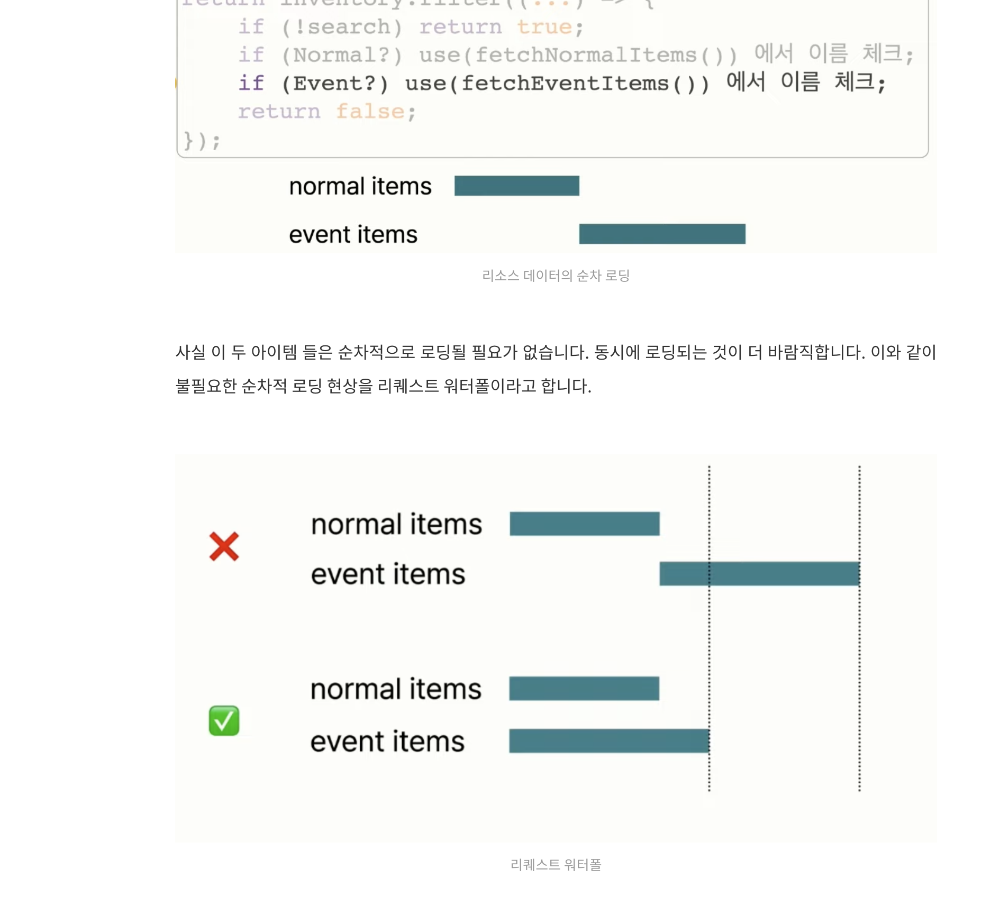
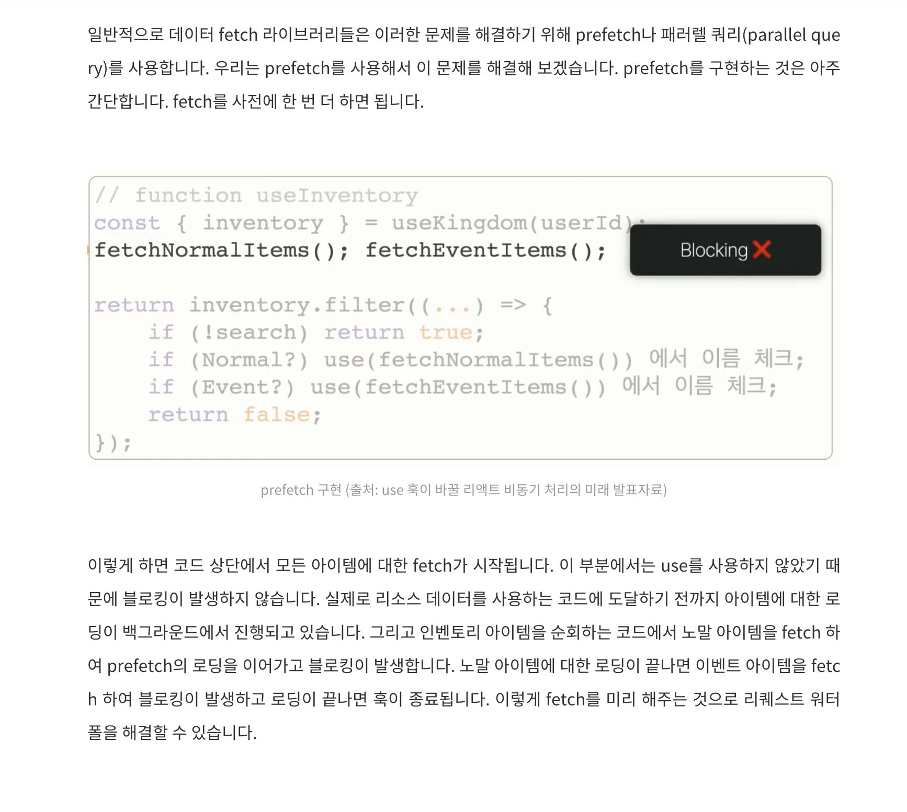
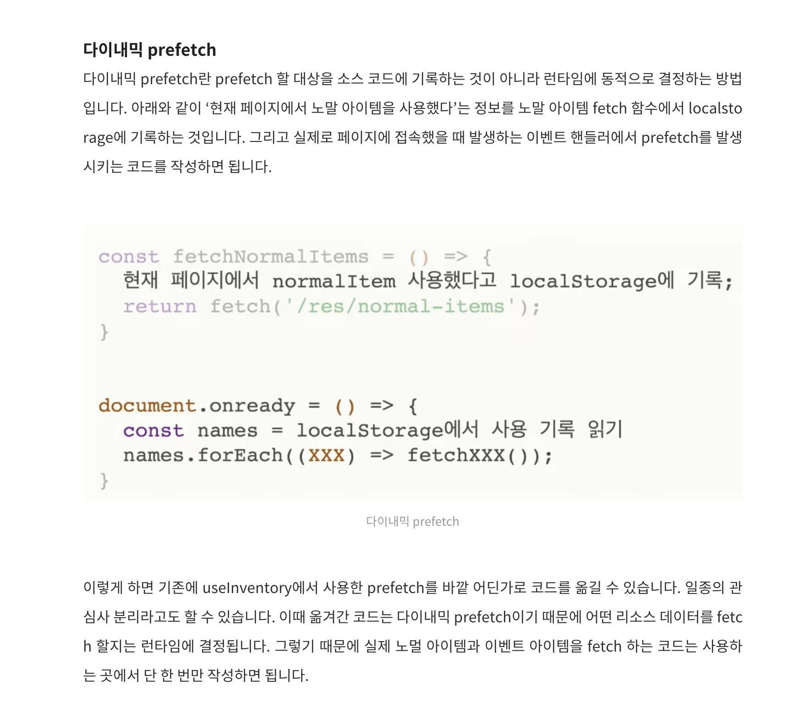
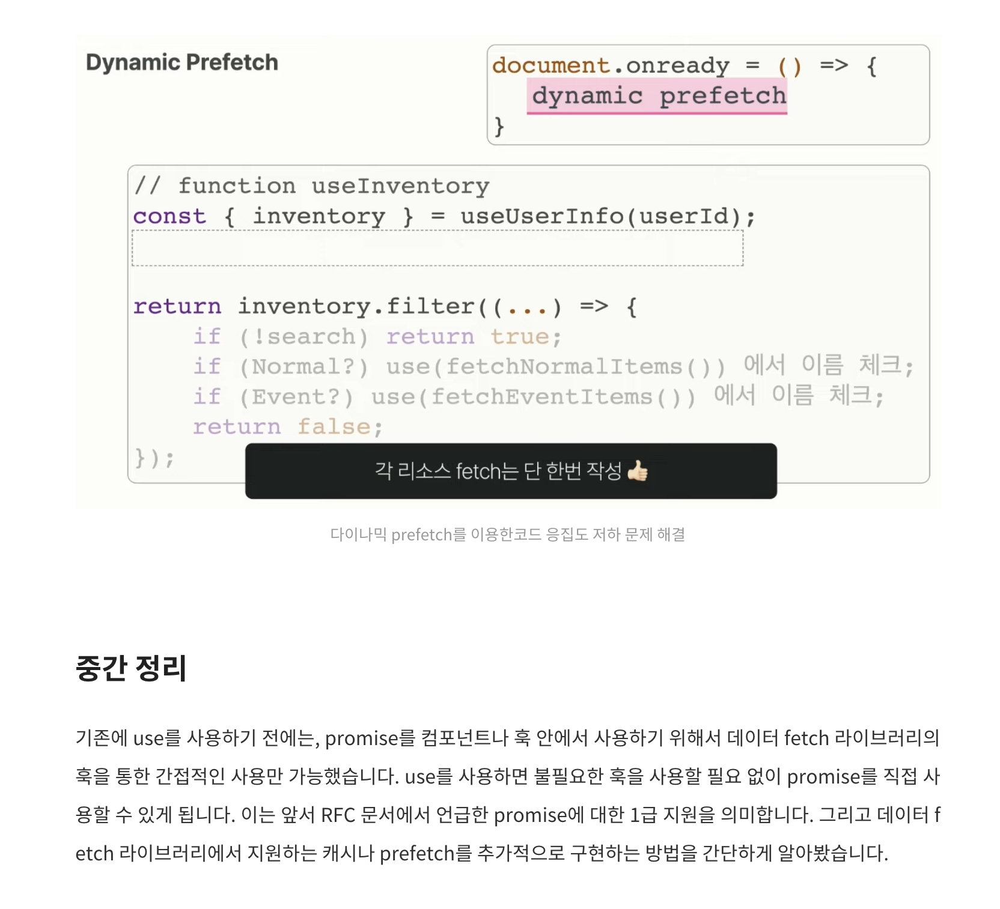
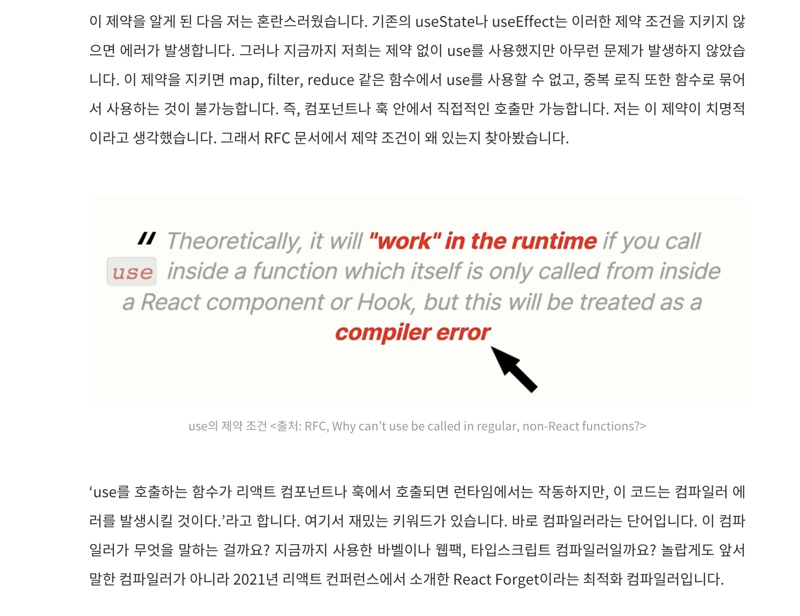
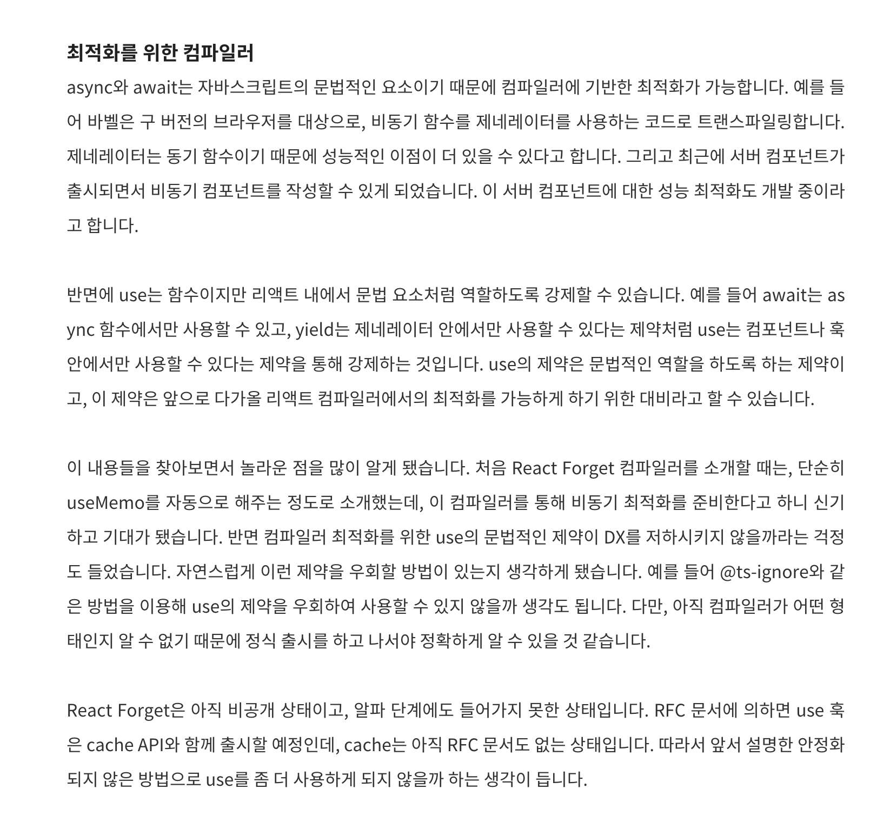
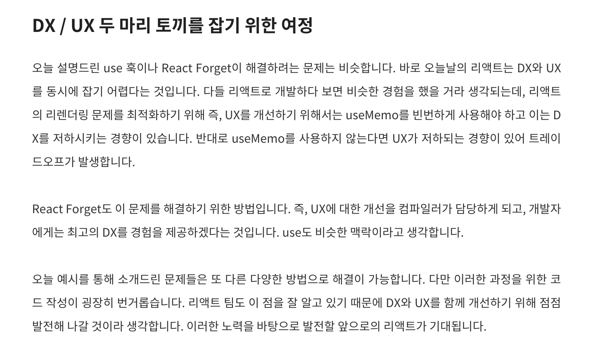

### 중복 fetch 문제

use는 다른 리액트의 훅과 달리 조건부 호출이 가능.

- 조건문, 반복문
- return 문 다음
- 이벤트 핸들러
- 클래스 컴포넌트
- useMemo, useReducer, useEffect에 전달한 클로저

그러므로 use를 사용하면, 리소스 데이터를 사용하는 곳에서 직접적으로 사용 가능

```js
function useProduct() {
  use(fetchItems);
}
```

이렇게 작성하면, 코드 상단에 불필요한 훅들이 쌓이지 않아 DX 향상 가능. + 필요한 순간에만 리소스 로딩 가능.

=> 문제는 중복 fetch.

fetchItems하는 promise가 resolve 되면 리렌더링되고, 리렌더링이 완료되면 다시 fetch하므로 무한반복되어버림.

- 이는, 캐시 기능을 추가하면 해결 가능.

```js
const fetchItems = cache(() => {
  return fetch("/items");
});

function useProduct() {
  use(fetchItems);
}
```

일종의 메모이제이션.

- 이렇게 하면 fetchItems는 항상 동일한 promise 인스턴스를 리턴.
- 추가적으로 promise의 refetch 기능도 있으면 좋음.
- cache api는 react 공식 api로 추가 예정(해당 팀에서는 lodash의 memoize 함수 사용)

### request waterfall 문제

use를 사용했기 때문에 블로킹이 발생. 해당 fetch에 대한 로딩이 끝난 다음에 또 다른 fetch 가능.



이런 문제를 해결하기 위해, 일반적인 데이터 fetch 라이브러리들은 prefetch나 parallel query를 사용함.

- prefetch는 결국, 사전에 fetch를 한번 더 하면 되는 거임.



문제는 이렇게 했을 때, 결국 또 다시 코드 응집성 문제 발생.

- prefetch로 request waterfall은 해결했지만, use를 사용한 이유는 코드 응집성 증가인데, 다시 코드 응집성이 낮아짐.

이를 위해 해당 팀은 dynamic prefetch 라는 아이디어로 해결.





React Forget이라는 최적화 컴파일러







더 다룰만한 주제들

1. 동기 함수 promise 블로킹 원리 - 컴포넌트 멱등성
2. promise 객체에서 결과 꺼내기
3. use를 context에서 사용하기
4. 서버 컴포넌트에서 use와 await를 함께 쓰기

## References

[use 훅이 바꿀 리액트 비동기 처리의 미래 맛보기(2)](https://yozm.wishket.com/magazine/detail/2374/)<br>
[RFC: First class support for promises and async/await #229](https://github.com/reactjs/rfcs/pull/229)<br>
