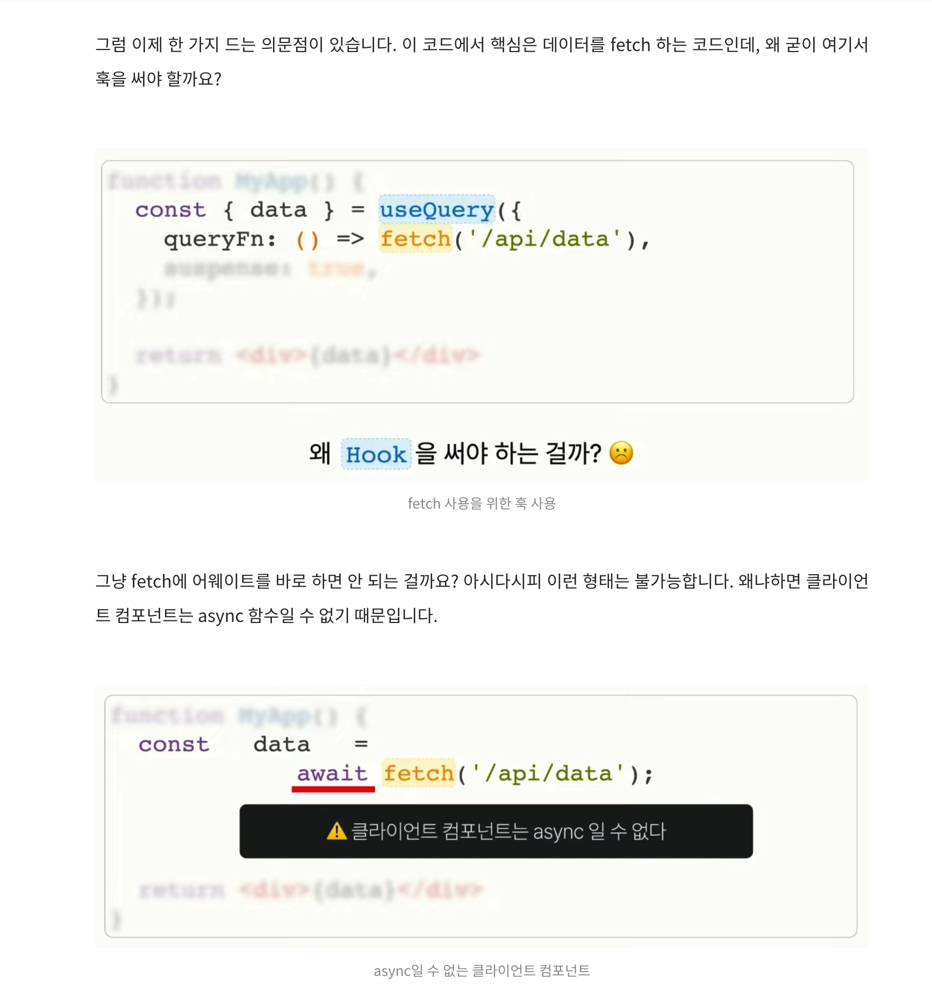
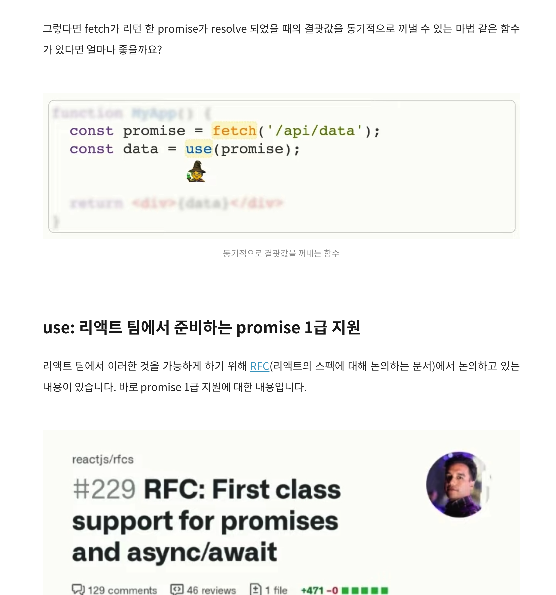
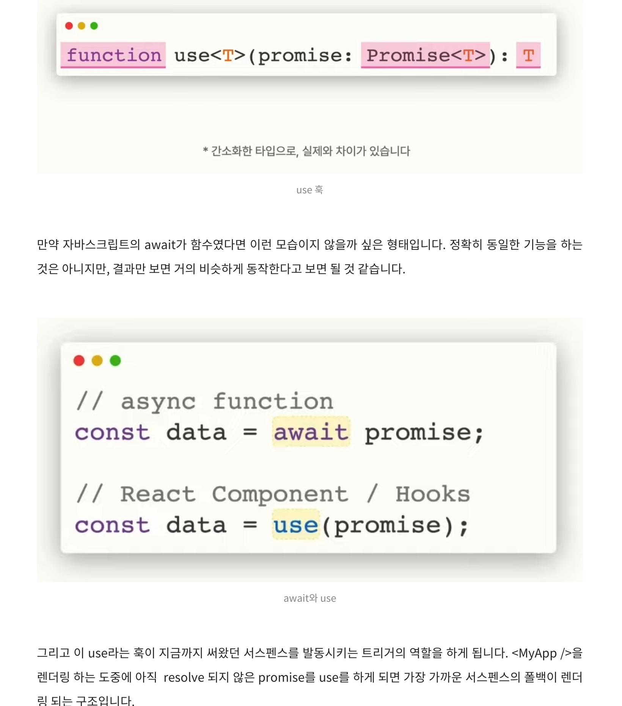
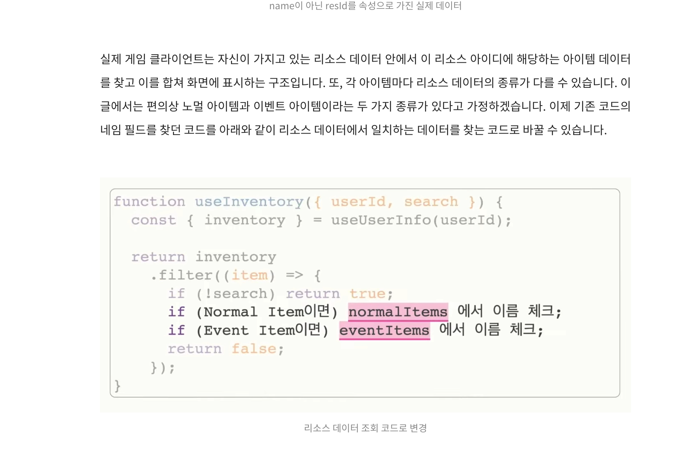
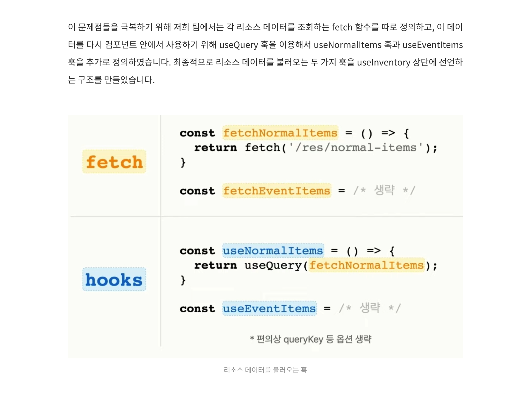
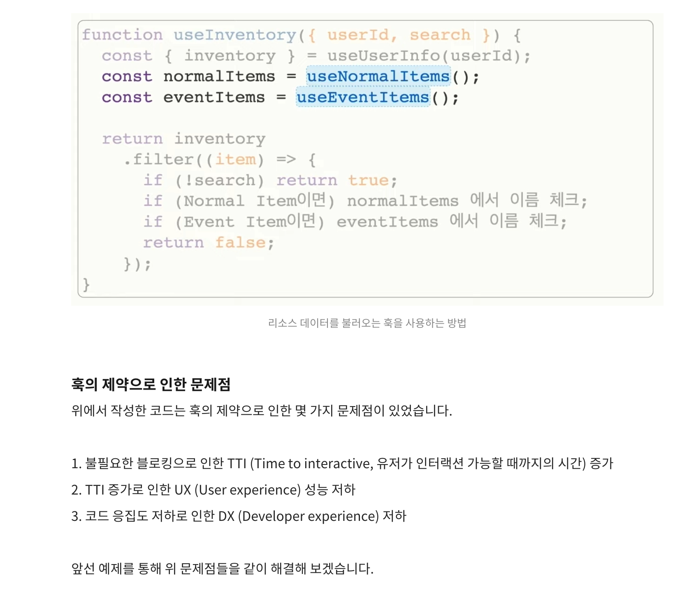
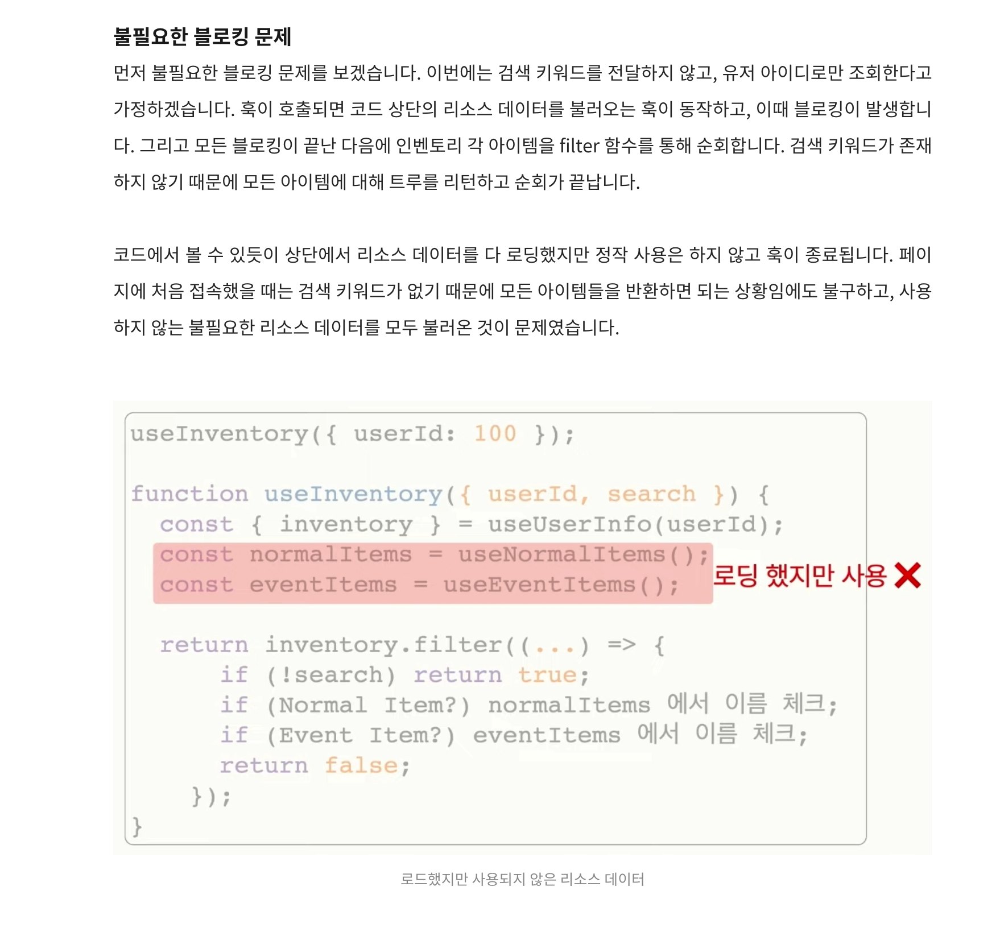
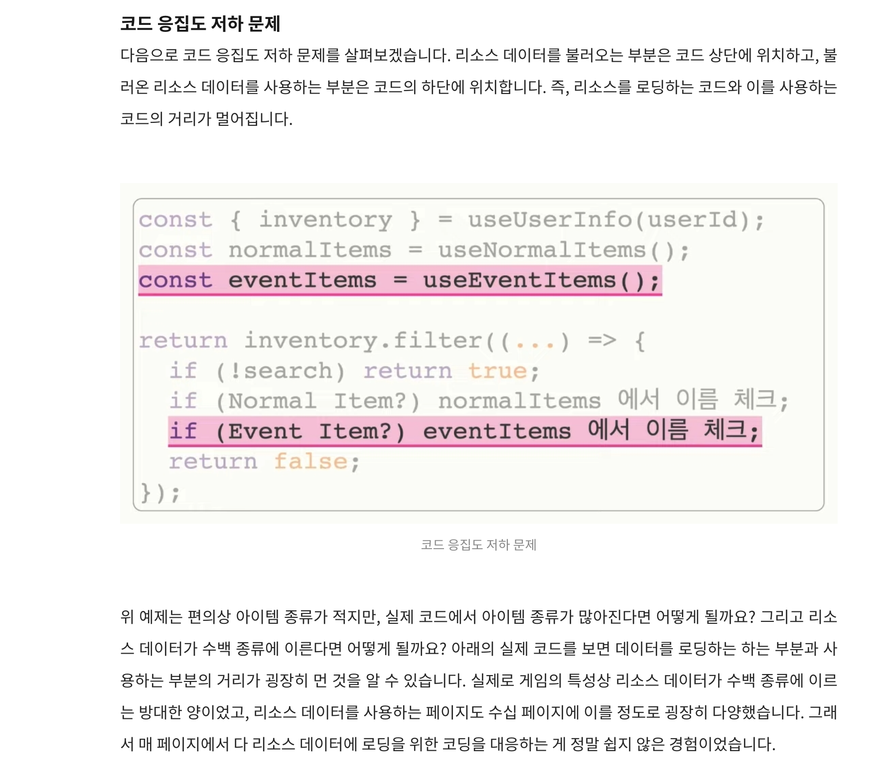
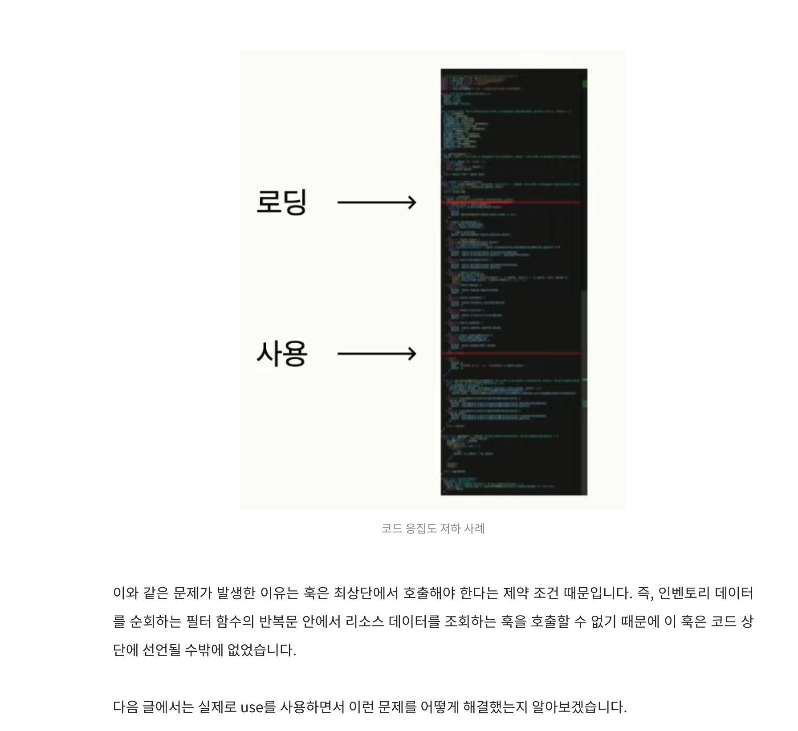

### react의 use

useEffect, useState를 사용한 커스텀 훅.

```js
const useQuery = ({ queryFn }) => {
  const [data, setData] = useState(undefined);
  const [error, setError] = useState(undefined);
  const [loading, setLoading] = useState(true);

  useEffect(() => {
    const fetchData = async () => {
      fetch("/v1/api/data")
        .then(setData)
        .catch(setError)
        .finally(() => setLoading(false));
    };
    fetchData();
  }, []);

  return { data, error, loading };
};
```

react query 같은 라이브러리를 사용하면, 위 fetch 패턴을 전문적으로 사용 가능.

```js
import { useQuery } from "@tanstack/react-query";

const Component = () => {
  const { data, error, loading } = useQuery({
    queryFe: () => fetch("v1/api/data"),
  });

  if (loading) return <div>loading...</div>;
  if (error) return <div>{error.message}</div>;
  return <div>{data}</div>;
};
```

리액트 서스펜스를 사용하면, 관심사 분리 가능.

- 우리는 `데이터 로딩이 완료된 상태`만 고려하면 됨.

react 18의 Suspense와 react 16의 ErrorBoundary를 조합해서 사용.

```js
<ErrorBoundary>
  <Suspense>
    <MyComponent />
  </Suspense>
</ErrorBoundary>
```

react query를 사용한다면 아주 쉽게 서스펜스 옵션만 켜주면 됨.

```js
import { useQuery } from "@tanstack/react-query";

const Component = () => {
  const { data, error, loading } = useQuery({
    queryFe: () => fetch("v1/api/data"),
    suspense: true,
  });

  if (loading) return <div>loading...</div>;
  if (error) return <div>{error.message}</div>;
  return <div>{data}</div>;
};
```



클라이언트 컴포넌트는 async 함수일 수 없으므로 fetch만 사용할 수 없음.

- 이걸 위해 등장하는 `use`





use 중간정리

- use라는 새로운 훅 출시 예정
- use는 서스펜스 트리거
- use는 await과 비슷한 역할. (async를 못쓰는 클라이언트를 위함)
- use는 조건부 호출 가능.

### use 훅 case study

인벤토리 안에서, 유저 정보를 가져와서 filtering을 하는 코드임.



일반적으로 게임 클라이언트는 접속 전에 리소스 데이터를 다운로드 받지만, 웹은 그럴 수 없음.

- 접속마다 수십mb 다운받기 부담스러움
- 개발환경에서 매번 업데이트 => 캐싱 효율성 떨어짐
- 꾸준히 증가하는 데이터 총량 => 확장성X





코드 블로킹 => tti 증가



코드 응집도 저하 (낮은 모듈성)





## References

[use 훅이 바꿀 리액트 비동기 처리의 미래 맛보기(1)](https://yozm.wishket.com/magazine/detail/2373/)<br>
[객체의 결합도 & 응집도 의미와 단계 💯 총정리](https://inpa.tistory.com/entry/OOP-%F0%9F%92%A0-%EA%B0%9D%EC%B2%B4%EC%9D%98-%EA%B2%B0%ED%95%A9%EB%8F%84-%EC%9D%91%EC%A7%91%EB%8F%84-%EC%9D%98%EB%AF%B8%EC%99%80-%EB%8B%A8%EA%B3%84-%EC%9D%B4%ED%95%B4%ED%95%98%EA%B8%B0-%EC%89%BD%EA%B2%8C-%EC%A0%95%EB%A6%AC)<br>
