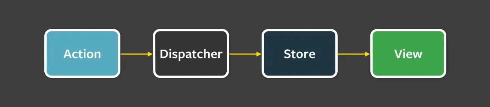

## 비교 목록

jotai, mobx, recoil, redux, zustand

## 유형 분류

### flux 방식

flux 아키텍쳐 모델 기반 중앙 집중형 상태 관리 방식. (redux, zustand)

flux 패턴에서 데이터는 단방향으로 흐름.

- action 발생 => dispatcher에서 해석 후 store 업데이트,
- store를 구독하는 view 갱신

중앙집중화된 store에 여러 상태를 한번에 관리. (물론 Store도 쪼갤 수 있는 유연함도 존재함) 
즉, top-down 방식

상태를 집중된 한 곳에서 관리하므로, 여러 컴포넌트 간 공유하는 상태를 관리하는 데 효과적임.

굳이 컴포넌트 간 공유하는 상태가 많지 않고 쪼개져 있다면 불필요함.

**redux vs zustand**

redux는 보일러플레이트 장황. 러닝커브 존재. 
zustand는 간단한 편. 처음 시작하는 프로젝트라면 zustand 좋음

### Proxy 방식

mobX.

상태를 프록시 객체로 래핑. => 중첩된 객체 상태 관리에 유용.(상태 복사, 속성 변경, 새로운 객체 생성 등의 과정 거칠 필요 없음)

중첩된 객체 상태 관리도 사실, 훅을 어떻게 만드느냐에 따라 다른 상태관리 라이브러리로도 충분히 커버 가능.

프록시를 통해 상태를 직접 변경함. 
객체 지향 프로그래밍과 잘맞음.

### Atomic 방식

recoil, jotai.

상태를 원자 단위로 쪼갬.

상태 관리 모듈화가 쉽고, 코드 재사용성 높아짐.

=> 일반적으로 서버 상태 관리를 react query로 하고 개별적으로 쪼개져 있는 Ui 상태만 원자단위로 관리할 때 Recoil 조합을 많이 사용하는 듯.

recoil보다 jotai가 가볍고, jotai가 recoil보다 업데이트 빈번함.

## 비교

flux 패턴의 경우, 서버상태+클라이언트 상태 종합적으로 고려하는 경우.

react query 같은 서버 상태 관리 툴을 쓴다면, 원자 단위로 고려하는 Recoil이나 jotai가 더 적합한듯.

zustand가 jotai보다도 가벼움. 
zustand는 vanillajs도 지원. jotai는 React만 지원.

zustand, redux가 Top-down이라면, 
jotai, recoil는 Bottom-up 방식.

## 내 결론

`react query + jotai(recoil) 조합을 쓰거나 아니면 redux, zustand 중 하나를 쓰거나`가 무난한 결론인듯.?

서버 상태 관리 툴을 사용하고 있다면, 사실 상태 관리가 필요한 건 각 컴포넌트 단위별로 쪼개는 UI 상태관리일 것이고. 
그럴 때는 Atomic한 상태 관리가 유연함.

반대로 서버 상태까지 별도로 관리하고자 한다면 중앙집중형이 적절

## 참고자료

[우리 팀이 Zustand를 쓰는 이유](https://velog.io/@greencloud/%EC%9A%B0%EB%A6%AC-%ED%8C%80%EC%9D%B4-Zustand%EB%A5%BC-%EC%93%B0%EB%8A%94-%EC%9D%B4%EC%9C%A0) 
