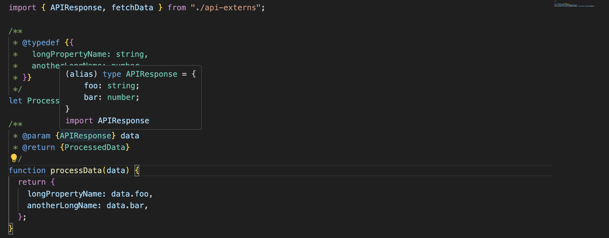

## 클로저 컴파일러

[구글의 클로저 컴파일러](https://github.com/google/closure-compiler)란?

closure-compiler(이하 cc)는 타입스크립트(이하 ts)와 달리, js 언어에 새로운 구문을 추가하지 않는다.
<br>대신 jsdoc 스타일의 주석을 통해 타입을 추가한다.

```js
function max(a: number, b: number): number {
  return a > b ? a : b;
}
```

위 ts와 달리 cc는 아래와 같이 주석으로 타입을 지정한다.

```js
/**
 * @param {number} a
 * @param {number} b
 * @return {number}
 */
function max(a, b) {
  return a > b ? a : b;
}
```

위와 같이 작성하고 max를 잘못 호출하면 다음 에러가 발생한다.

```bash
> google-closure-compiler "--warning_level" "VERBOSE" "max.js"

max.js:12:16: WARNING - [JSC_TYPE_MISMATCH] actual parameter 1 of max does not match formal parameter
found   : string
required: number
12| console.log(max('foo', 'bar'));
                    ^^^^^

max.js:12:23: WARNING - [JSC_TYPE_MISMATCH] actual parameter 2 of max does not match formal parameter
found   : string
required: number
12| console.log(max('foo', 'bar'));
                    ^^^^^

0 error(s), 2 warning(s), 100.0% typed
function max(a,b){return a>b?a:b}console.log(max("foo","bar"));
```

tsc와 마찬가지로, 코드의 타입 오류를 보고하며 오류가 발생한 js 코드를 출력한다.
<br>차이점으로는, cc는 `100.0% typed`와 같은 문구로 타입을 얼마나 지정했는지 알려준다(ts로 비유하자면 any를 얼마나 썼느냐).
<br>또 다른 차이점으로, cc는 js 코드를 출력할 때 경량화(minify)한다.

`function max(a,b){return a>b?a:b}console.log(max("foo","bar"));`

cc의 가장 기본적인 목표는 가능한 작은 js를 생성하는 것.

- 이유는 : 출시 당시 네트워크 속도가 지금보다 훨씬 느렸다. => 페이지 로딩 속도를 높이기 위해 js 번들 사이즈를 줄이는 게 가장 큰 목표였다.

예를 들어, [api-externs.js](./cc-example/api-externs.js)의 코드는 타입을 정의하고 함수를 선언하는 externs 파일이다(ts에서 타입 선언 파일과 동일).

- 타입은 jsdoc 주석의 @typedef를 통해 구현된다.
- fetchData 함수는 ts에서 declare function과 같으며 cc는 빈 함수 본문을 사용한다.

[api.js](./cc-example/api.js) 에서는 선언한 externs 파일을 가져와서 사용하는 예제이다.


이렇게 작성한 api 코드를 cc로 컴파일하면 다음과 같은 결과물이 나온다.

```js
let ProcessedData;

function processData(a) {
  return {
    longPropertyName: a.foo,
    anotherLongName: a.bar,
  };
}

const apiData = fetchData(),
  processedData = processData(apiData);

console.log(processedData.longPropertyName, processedData.anotherLongName);
```

여기에 cc의 목표였던 고급 최적화를 켜면 다음과 같이 난독화를 통해 번들 사이즈를 줄인다.

```js
var a,
  b = fetchData();

a = {
  h: b.foo,
  g: b.bar,
};

console.log(a.h, a.g);
```

난독화할 때 규칙이 있는데,

- externs" 파일에 있는 심벌은 외부로 공개되므로 변경할 수 없지만, 다른 곳에 있는 심벌은 내부 클로저 컴파일러가 적절하다고 판단하는 대로 난독화하거나 인라인할 수 있다는 규칙이다.

ts는 기본적으로 경량화를 하거나, 변수 이름을 변경하지 않는다. 경량화를 하더라도 이렇게 cc처럼 급진적으로 하지 않는다.
<br>어쨌든 이러한 cc의 특징 덕분에 cc를 사용하면 번들 크기를 다이나믹하게 줄일 수 있다.

## 클로저 컴파일러가 타입스크립트에 패배한 이유

externs 파일이 없으면 cc는 fetchData나 foo, bar와 같은 프로퍼티도 난독화를 했을 것이다.
<br>그러다 보니 externs 파일이 매우 중요했다.

프로퍼티 이름을 일관되게 경량화해야 하는데, 안 그러면 호출이나 참고 등에서 문제가 생기므로.
<br>그러려면, cc가 해당 이름을 사용할 수 있는 모든 소스 코드에 엑세스할 수 있어야 한다.

오늘날 npm 맥락에서는 이게 불가능하다. 대부분의 프로젝트 코드들은 서드파티 코드에 의존한다.
cc를 사용해 경량화가 효과적이려면, 모든 서드파티 코드들이 cc를 염두에 두고 작성되어야 하나, 그건 불가능하다.

당시 구글메일에서 js 코드를 작성할 때 cc를 모두 염두에 두고 작성하기도 했고, 대기업 특성상 서드파티 코드에 의존 비율이 낮아 가능했던 것이다.

반면 ts는 기존 라이브러리의 타입만 알면 된다. 라이브러리의 구현까지 알 필요 없으므로, 이게 js 생태계의 엄청난 다양성에 더 맞아떨어졌다.

## 마무리

08년도에는 네트워크 속도가 지금보다 훨씬 느렸다. 번들 크기를 줄이는 게 급선무였다.
<br>지금도 번들 사이즈를 줄이는 건 중요하지만, cc처럼 극단적으로 모든 의존성을 관리하면서까지 줄여야 할 정도는 아니게 되었다.

ts는 cc보다 개발자 도구에 더 중점을 두었다.
<br>ts는 tsc만큼이나, tsserver에 중점을 둔다. ts를 기반으로 작성된 vscode에서 ts를 사용하는 건 개발하는 입장에서 너무 편리하다.

- cc는 js의 실수를 줄이기 위해 타입을 사용했다면, 오늘날 ts는 개발 생산성을 높이기 위해 타입을 사용한다.

ts는 오픈 소스였기에 js 커뮤니티의 참여가 활발했다. 반면 cc는 구글 내부 도구의 오픈소스였다. 그렇기에 구글이 내부적으로 주로 사용했다.
